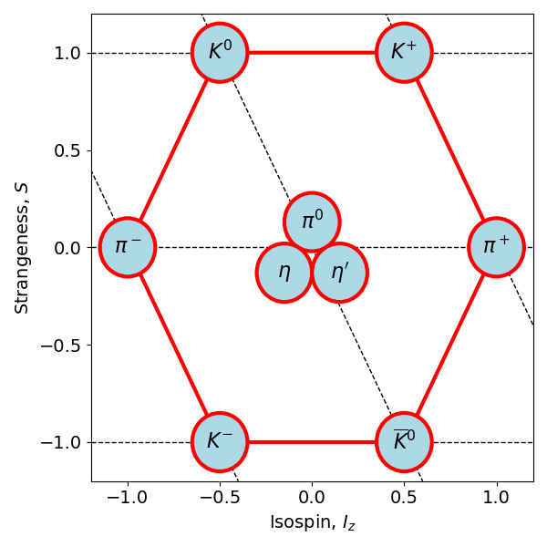
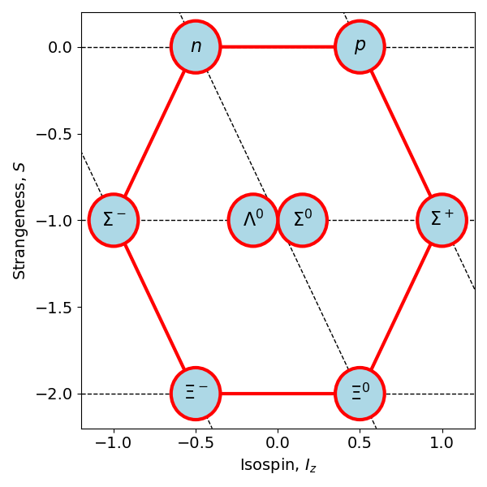
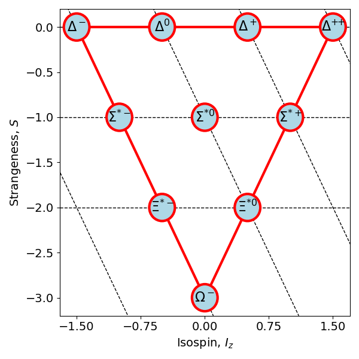
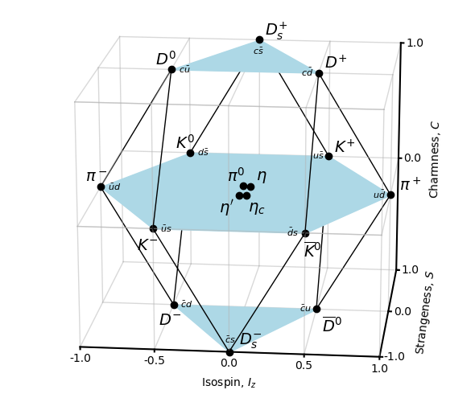
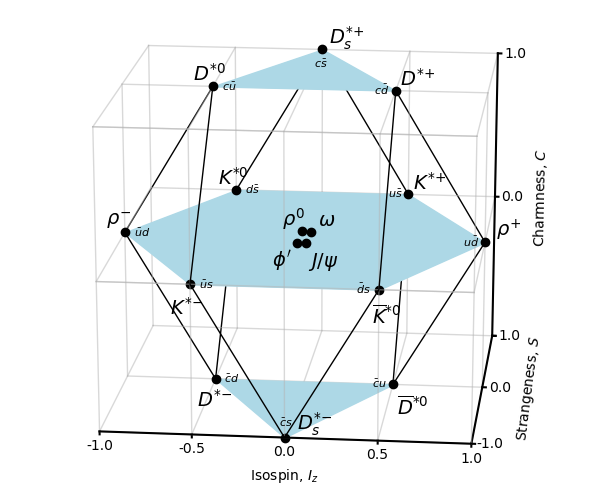
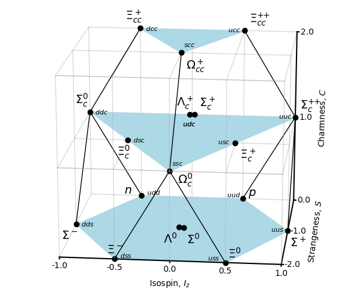
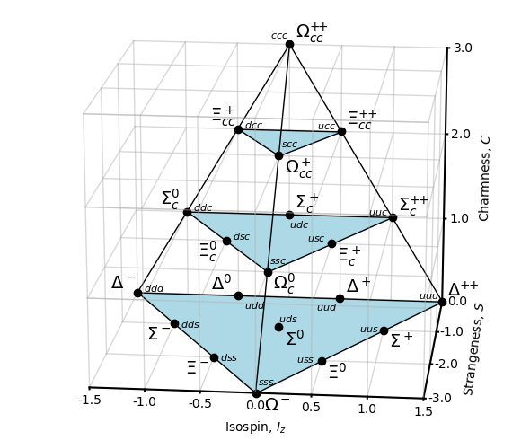

# Make Isospin diagrams for various known hadrons

This code makes hadron isospin diagrams with `matplotlib`.

It contains many hacks to get things in the right place.

Would be lovely to somehow incorporate ``bottomness" and have extra diagrams for those.

Will produce

- Spin-0 mesons (Iz,S) plane

- Spin-1 mesons (Iz,S) plane

- Spin-1/2 baryons (Iz,S) plane

- Spin-3/2 baryons (Iz,S) plane

- Spin-0 mesons (Iz,S,C) plane

- Spin-1 mesons (Iz,S,C) plane

- Spin-1/2 baryons (Iz,S,C) plane

- Spin-3/2 baryons (Iz,S,C) plane

